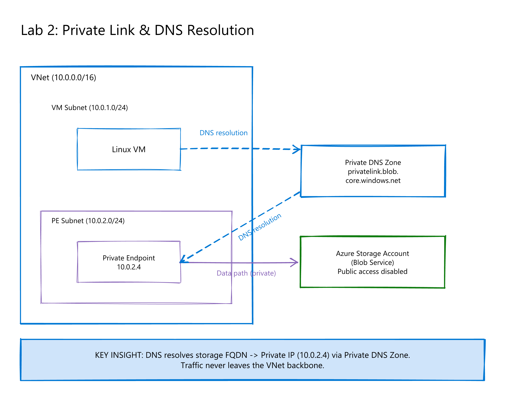

# Lab 3 – Private Link & DNS Resolution

## Scenario

> "Why is traffic still going over public even though a private endpoint exists?"

This lab shows that Private Link adoption is **fundamentally DNS-driven**. A Private Endpoint alone doesn't redirect traffic — the DNS resolution must return the private IP for the connection to flow privately.

## Key Takeaway

**Private Link = Private Endpoint + Private DNS Zone + VNet Link.** Without proper DNS configuration, `nslookup` resolves to the public IP and traffic bypasses the private endpoint entirely.

## Architecture



| Resource | Purpose |
|----------|---------|
| VNet (10.210.0.0/16) | Lab network |
| Storage Account | PaaS service with dual access |
| Private Endpoint | Private connection to blob storage |
| Private DNS Zone | `privatelink.blob.core.windows.net` |
| VNet Link | Links DNS zone to VNet for resolution |
| Linux VM | Test workload for nslookup |

## Deploy to Azure

Click the button below to deploy this lab directly to your Azure subscription:

[](https://portal.azure.com/#create/Microsoft.Template/uri/https%3A%2F%2Fraw.githubusercontent.com%2FPaulJohnston88%2FTechExcellence2026%2Fmain%2Flabs%2Flab2-private-link-dns%2Fazuredeploy.json)

### Parameters

| Parameter | Description |
|-----------|-------------|
| `location` | Azure region (defaults to resource group location) |
| `adminUsername` | VM admin username |
| `adminPassword` | VM admin password |

## Manual Deployment

### Bash (Azure CLI)

```bash
# Create resource group
az group create --name te-rg-demo2-privatelink-001 --location uksouth

# Deploy template
az deployment group create \
  --resource-group te-rg-demo2-privatelink-001 \
  --template-file azuredeploy.json \
  --parameters adminUsername=azureuser adminPassword='<YourPassword>'
```

### PowerShell (Azure CLI)

```powershell
# Create resource group
az group create --name te-rg-demo2-privatelink-001 --location uksouth

# Deploy template
az deployment group create `
  --resource-group te-rg-demo2-privatelink-001 `
  --template-file azuredeploy.json `
  --parameters adminUsername=azureuser adminPassword='<YourPassword>'
```

### PowerShell (Az Module)

```powershell
# Create resource group
New-AzResourceGroup -Name te-rg-demo2-privatelink-001 -Location uksouth

# Deploy template
New-AzResourceGroupDeployment `
  -ResourceGroupName te-rg-demo2-privatelink-001 `
  -TemplateFile azuredeploy.json `
  -adminUsername 'azureuser' `
  -adminPassword (ConvertTo-SecureString '<YourPassword>' -AsPlainText -Force)
```

## Demo Steps

1. **Connect to the VM** via Serial Console or Bastion
2. **Resolve the storage FQDN** (with DNS link active):
   ```bash
   nslookup <storageAccountName>.blob.core.windows.net
   ```
   → Returns the **private IP** (10.210.2.x) from the Private DNS Zone
3. **Remove the VNet link** from the Private DNS Zone (Portal or CLI):

   **Bash:**
   ```bash
   az network private-dns link vnet delete \
     --resource-group te-rg-demo2-privatelink-001 \
     --zone-name privatelink.blob.core.windows.net \
     --name demo2-blob-dns-link --yes
   ```

   **PowerShell:**
   ```powershell
   az network private-dns link vnet delete `
     --resource-group te-rg-demo2-privatelink-001 `
     --zone-name privatelink.blob.core.windows.net `
     --name demo2-blob-dns-link --yes
   ```
4. **Resolve again:**
   ```bash
   nslookup <storageAccountName>.blob.core.windows.net
   ```
   → Now returns the **public IP** — traffic goes over the Internet!
5. **Discuss:** The Private Endpoint still exists, but without DNS, the client never uses it.

## Outputs

| Output | Description |
|--------|-------------|
| `storageAccountName` | Storage account name for testing |
| `storageBlobFqdn` | FQDN to use with nslookup |
| `vmPrivateIp` | VM private IP |

## Clean Up

**Bash:**
```bash
az group delete --name te-rg-demo2-privatelink-001 --yes --no-wait
```

**PowerShell:**
```powershell
az group delete --name te-rg-demo2-privatelink-001 --yes --no-wait

# Or using Az Module:
Remove-AzResourceGroup -Name te-rg-demo2-privatelink-001 -Force -AsJob
```
