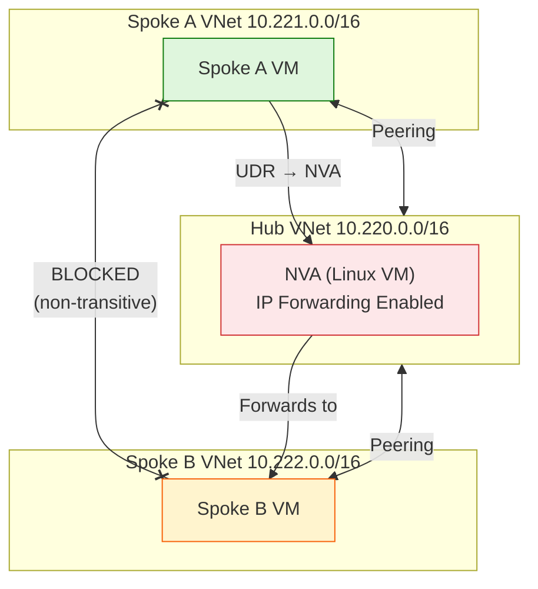

# Lab 3 – VNet Peering Transitivity

## Scenario

> "Why can't Spoke A reach Spoke B?"

This lab demonstrates that **VNet peering is non-transitive**. Even though Spoke A peers with the Hub and the Hub peers with Spoke B, traffic doesn't automatically flow between spokes. You must explicitly route through a hub appliance (NVA/Firewall).

## Key Takeaway

**VNet peering does NOT provide transitive routing.** Spoke-to-spoke communication requires UDRs pointing traffic through a hub Network Virtual Appliance (NVA) with IP forwarding enabled.

## Architecture



> **Key Insight:** VNet peering is **non-transitive**. Spoke A ↔ Hub and Spoke B ↔ Hub does NOT mean Spoke A ↔ Spoke B. Route through an NVA with UDRs.

| Resource | Purpose |
|----------|---------|
| Hub VNet (10.220.0.0/16) | Central transit network |
| Spoke A VNet (10.221.0.0/16) | First spoke network |
| Spoke B VNet (10.222.0.0/16) | Second spoke network |
| Hub NVA VM (10.220.1.4) | Linux VM with IP forwarding |
| VNet Peerings | Hub↔Spoke A, Hub↔Spoke B |
| UDRs | Route spoke-to-spoke via NVA |
| NSG | Allow ICMP for ping tests |

## Deploy to Azure

Click the button below to deploy this lab directly to your Azure subscription:

[](https://portal.azure.com/#create/Microsoft.Template/uri/https%3A%2F%2Fraw.githubusercontent.com%2FPaulJohnston88%2FTechExcellence2026%2Fmain%2Flabs%2Flab3-vnet-peering-transitivity%2Fazuredeploy.json)

### Parameters

| Parameter | Description |
|-----------|-------------|
| `location` | Azure region (defaults to resource group location) |
| `adminUsername` | VM admin username |
| `adminPassword` | VM admin password |

## Manual Deployment

### Bash (Azure CLI)

```bash
# Create resource group
az group create --name te-rg-demo3-peering-001 --location northeurope

# Deploy template
az deployment group create \
  --resource-group te-rg-demo3-peering-001 \
  --template-file azuredeploy.json \
  --parameters adminUsername=azureuser adminPassword='<YourPassword>'
```

### PowerShell (Azure CLI)

```powershell
# Create resource group
az group create --name te-rg-demo3-peering-001 --location northeurope

# Deploy template
az deployment group create `
  --resource-group te-rg-demo3-peering-001 `
  --template-file azuredeploy.json `
  --parameters adminUsername=azureuser adminPassword='<YourPassword>'
```

### PowerShell (Az Module)

```powershell
# Create resource group
New-AzResourceGroup -Name te-rg-demo3-peering-001 -Location northeurope

# Deploy template
New-AzResourceGroupDeployment `
  -ResourceGroupName te-rg-demo3-peering-001 `
  -TemplateFile azuredeploy.json `
  -adminUsername 'azureuser' `
  -adminPassword (ConvertTo-SecureString '<YourPassword>' -AsPlainText -Force)
```

## Demo Steps

1. **Connect to Spoke A VM** via Serial Console or Bastion
2. **Ping the Hub NVA** (should work — direct peering):
   ```bash
   ping 10.220.1.4 -c 4
   ```
   → ✅ Success — Spoke A has a direct peering with Hub
3. **Ping Spoke B** (fails — peering is non-transitive):
   ```bash
   ping 10.222.1.4 -c 4
   ```
   → ❌ Fails — No direct peering between spokes, and peering doesn't transit
4. **Show effective routes** (no route to Spoke B):

   **Bash:**
   ```bash
   az network nic show-effective-route-table \
     --resource-group te-rg-demo3-peering-001 \
     --name te-nic-demo3-spokea-001 -o table
   ```

   **PowerShell:**
   ```powershell
   az network nic show-effective-route-table `
     --resource-group te-rg-demo3-peering-001 `
     --name te-nic-demo3-spokea-001 -o table

   # Or using Az Module:
   Get-AzEffectiveRouteTable `
     -ResourceGroupName te-rg-demo3-peering-001 `
     -NetworkInterfaceName te-nic-demo3-spokea-001 | Format-Table
   ```
5. **Explain the fix:** UDRs route 10.222.0.0/16 → NVA (10.220.1.4), NVA has IP forwarding enabled, and hub peerings allow forwarded traffic
6. **Ping Spoke B again** (now works with UDRs applied):
   ```bash
   ping 10.222.1.4 -c 4
   ```
   → ✅ Success — Traffic flows: Spoke A → Hub NVA → Spoke B

> **Note:** The ARM template deploys with UDRs already configured. To demonstrate the "broken" state first, remove the route table associations from the spoke subnets before the demo.

## Outputs

| Output | Description |
|--------|-------------|
| `hubNvaIp` | Hub NVA private IP (10.220.1.4) |
| `spokeAVmIp` | Spoke A VM private IP |
| `spokeBVmIp` | Spoke B VM private IP |

## Clean Up

**Bash:**
```bash
az group delete --name te-rg-demo3-peering-001 --yes --no-wait
```

**PowerShell:**
```powershell
az group delete --name te-rg-demo3-peering-001 --yes --no-wait

# Or using Az Module:
Remove-AzResourceGroup -Name te-rg-demo3-peering-001 -Force -AsJob
```
